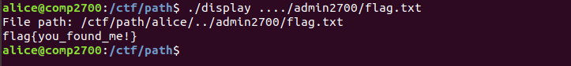
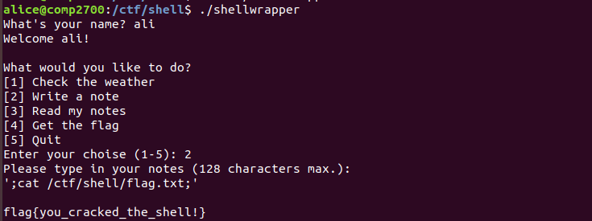

# ANU COMP2700 2020 Writeup

## CTF CHALLENGE #1 - WALK/THE/PATH

思路：首先，题目要求使用目录穿越漏洞读取 /ctf/shell/admin2700/flag.txt 文件，并且 display 程序是有权限读取 /ctf/shell/admin2700/flag.txt 文件的。问题的难点在于 display 程序对 uid 进行的判断并且对传入的目录参数进行的过滤，导致我们是没有权限直接读取 /ctf/shell/admin2700/flag.txt 文件的，所以主要就是绕过过滤。

第一步，尝试读取 admin2700/flag.txt 文件，失败，发现目录被拼接。

第二步，想到查看 src/display.c 源码，看该代码的功能。发现关键功能就是拼接目录，读取内容，那么问题的关键就是绕过过滤，进行目录穿越。

主程序，拼接目录，查看内容。

过滤程序，防止目录穿越。

第三步，尝试绕过限制。过滤程序只是对连着的两个点号 .. 做了一次跳过，然后继续读取接下来的字符，发现使用四个 .... 即可，使用 ..../admin2700/flag.txt，绕过成功。

## CTF CHALLENGE #2 - I_$HELL_HACK

思路：题目要求使用命令注入漏洞读取 /ctf/shell/flag.txt 文件，使用 shellwrapper 程序之后发现该程序可以读取文件和写文件，所以尝试阅读源码寻找漏洞。

第一步，发现该程序可以读取和写入文件，所以想到利用该程序的漏洞读入 /ctf/shell/flag.txt 文件。

第二步，阅读源码，发现有一处可以用单引号 ' 对命令进行闭合后拼接命令。

第三步，尝试使用 ' 单引号对命令进行闭合，拼接命令读取 /ctf/shell/flag.txt 文件，使用 '; cat /ctf/shell/flag.txt;' 成功读取。

## CTF CHALLENGE #5 - A GAME OF (RANDOM) NUMBERS

思路：看到题目为栈溢出类型漏洞，通过查看源码发现需要控制 answer 数组覆盖变量 guess 从而在接下来的判断处使 n == guess 成立从而执行 win() 函数打印 flag。

第一步，查看源码，发现只有在判断处使 n == guess 成立才会执行 win() 函数打印 flag。

第二步，栈溢出漏洞点就在 fgets() 函数处，answer 数组分配的大小为 14 个字节，却读取了 20 个字符。多出 6 个字符，占用 6 个字节，向上可覆盖 guess 变量。接着，想办法使溢出覆盖到 guess 的值和 atoi(answer) 的值相等即可。通过 sanitise() 函数源码找到方法，我们可以使用非数字字符控制 answer 字符数组结束字符 '\0' 的位置从而控制 atoi(answer) 的值。

第三步，尝试覆盖 guess 变量，并且控制 atoi(answer) 的值。Payload 可以有很多情况，下面使用其中一种解释。

A 字符的 ascii 值为 0x41，此 payload 把 guess 变量的内存值覆盖为 0x41414141，即十进制的 1094795585。又因为当 sanitise() 函数遇到第一个非数字字符时会将其修改为 '\0'，导致 answer 字符数组被截断使 atoi(answer) 的值等于 1094795585。所以判断 n == guess 成立，执行 win() 函数打印 flag 的值。

需要注意的是只要符合这种条件的 payload 都是可行的，payload 不唯一。

